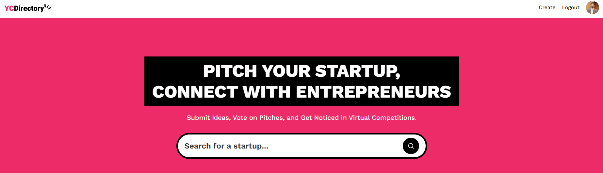
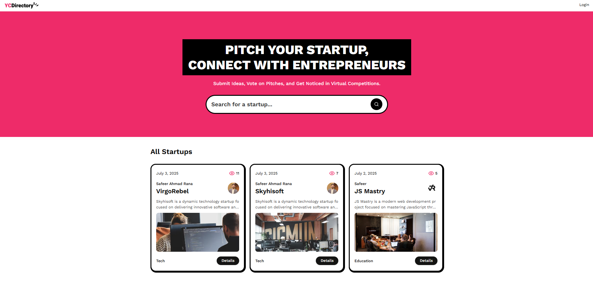
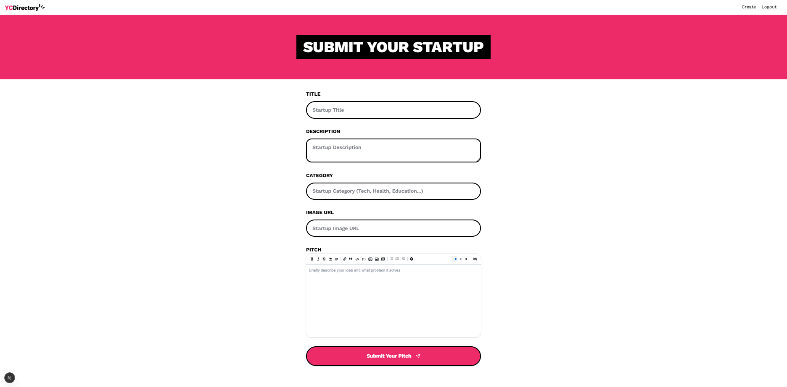
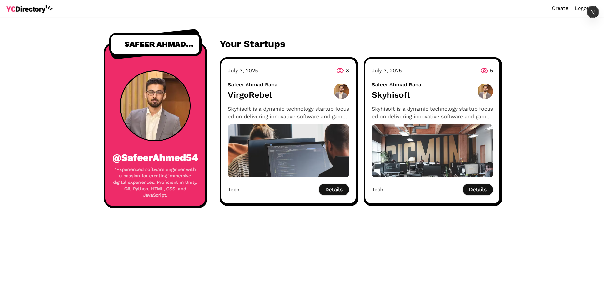

# 🧩 YC_Directory Startup Publishment



A modern full-stack web project built using **Next.js**, **Tailwind CSS**, and **Sanity CMS**, featuring advanced UI/UX design, responsive layout, and dynamic content management.

---

## 🚀 Features

- ⚡ Blazing-fast Next.js performance
- 🎨 Tailwind CSS for utility-first, responsive design
- ✍️ Sanity CMS integration for structured content management
- 💻 Frontend + Backend architecture
- 🌐 Marquee banner, diagonal layouts, and creative components
- 🔐 GitHub Auth with NextAuth.js

---

## 🛠️ Tech Stack

- **Framework**: [Next.js](https://nextjs.org/)
- **Styling**: [Tailwind CSS](https://tailwindcss.com/)
- **CMS**: [Sanity.io](https://www.sanity.io/)
- **Authentication**: [NextAuth.js](https://authjs.dev/)

---

## 📦 Installation

### 1. Clone the repo
```bash
git clone https://github.com/SafeerAhmed54/NextJs_Project.git
cd NextJs_Project
```

### 2. Install dependencies
```bash
yarn install
# or
npm install
```

### 3. Environment setup

Create a `.env.local` file with the following variables:

```env
NEXT_PUBLIC_SANITY_PROJECT_ID=your_project_id
NEXT_PUBLIC_SANITY_DATASET=your_dataset
NEXT_PUBLIC_SANITY_API_VERSION=v1
SANITY_WRITE_TOKEN=your_sanity_write_token
AUTH_SECRET=your_auth_secret
AUTH_GITHUB_ID=your_github_oauth_id
AUTH_GITHUB_SECRET=your_github_oauth_secret
```

> 💡 These values are available from [Sanity.io](https://www.sanity.io/manage) and [GitHub OAuth Apps](https://github.com/settings/developers).

### 4. Run the development server

```bash
yarn dev
# or
npm run dev
```

Visit `http://localhost:3000` to view the app.

---

## 🧪 Sanity CMS Setup

1. Navigate to your `studio` or CMS directory.
2. Run the following:
   ```bash
   sanity install
   sanity start
   ```
3. Add content using the CMS studio and it will reflect on your frontend.

---

## 🖼️ Project Screenshots

### 🏠 Home Page


### 📝 Create Page


### 👤 User Page


---

## 📁 Folder Structure

```bash
.
├── pages/              # Next.js pages (routes)
├── components/         # Reusable UI components
├── public/             # Static files
├── public/screenshots/ # Screenshots for README
├── sanity.config.ts    # Sanity configuration
├── tailwind.config.js  # Tailwind theme customization
└── styles/             # Global CSS (if needed)
```

---

## 🎯 Future Improvements

- Add multilingual support
- Add animations using Framer Motion
- Deploy with CI/CD
- Improve mobile-first design

---

## 🧑‍💻 Author

**Safeer Ahmed**

- GitHub: [@SafeerAhmed54](https://github.com/SafeerAhmed54)
- Email: safeerrana54@gmail.com

---

## 📄 License

This project is open-source and available under the [MIT License](LICENSE)